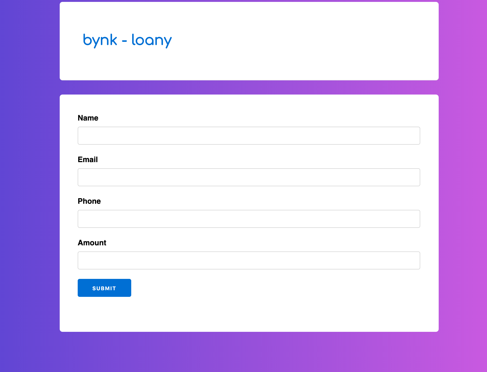

# Loany

## Description of the development process

I've started by implementing the business logic: the Scoring part.
First I've done the Agent to store the amounts.
Then I've implemented the Scoring service with the selection of the highest amount.
Then the prime number calculation has been added.

After this the Phoenix part has been started.
Migration & the entity has been created.

Once this was working correctly, the routes has been defined.
  - route : GET /requests/id/accepted
  - route : GET /requests/id/rejected

Hence the form has been created with data persitence.
Then the scoring logic has been added to the creation of the changeset.

When a basic system was running, data validation has been added.
Then some styling has been added with the javascript redirection after 3 sec on the rejected page.

## How to launch the project ?

### Setting the db

A dockerized version of PG is used:
  - launch it with the command:
`docker run --rm --name pg_loany -e POSTGRES_PASSWORD=postgres -e POSTGRES_USER=postgres postgres:10`

  - get the IP of the DB with the command:
`docker inspect pg_loany | ack IPAddress`

  - set the correct `hostname` of the db in the `dev.exs` and `test.exs`.

  - create the db with the command:
`mix ecto.create`

  - run migrations:
`mix ecto.migrate`

### Launch test

Once the db is up, launch tests with `mix test`.

### To start your Phoenix server:

  * Install dependencies with `mix deps.get`
  * Create and migrate your database with `mix ecto.setup`
  * Install Node.js dependencies with `cd assets && npm install`
  * Start Phoenix endpoint with `mix phx.server`

Now you can visit [`localhost:4000`](http://localhost:4000) from your browser.
